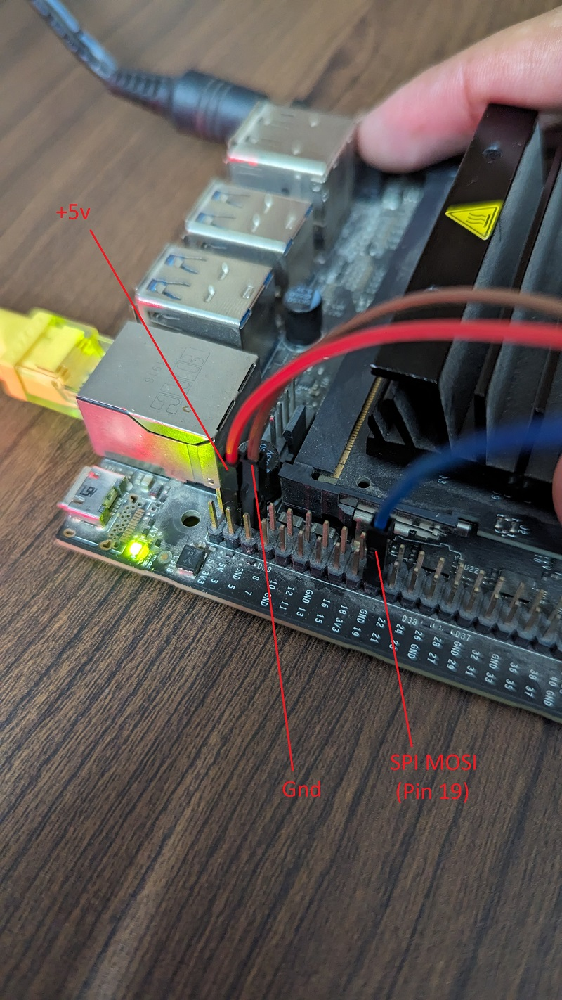

# Control LED Strip WS2812b with JETSON SPI 

C++ library to manage the GPIO header of the Nvidia JETSON boards

<h2 align="left">Connections:</h2>

- Connect LED Strip +5v & Gnd to the +5v and Gnd Pins on Jetson Nano as shown in the figur below. 

  
  <h2 align="left">How to Run:</h2>

- Clone the repo using `` git clone https://github.com/aliahmadXVR/jetson_SPI_ledControl.git``

- `` cd EXAMPLES_C++``

- ``sudo ./led_spi_control"

- The first led should blink green and red after 1 second interval"

